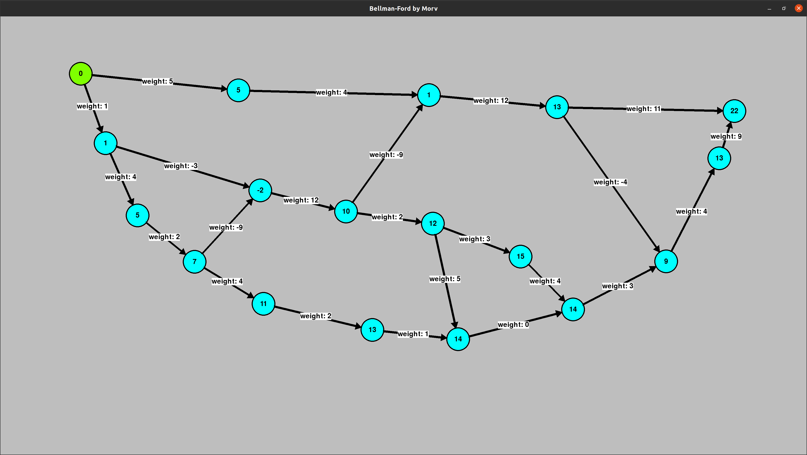

# BELLMAN-FORD ALGORITHM

## What it is?

This app allows you to draw a graph and run Bellman-Ford algorithm on it. (https://en.wikipedia.org/wiki/Bellman%E2%80%93Ford_algorithm)



## How to use it?

1. Run program (look section "How to install")
2. Build a graph by adding vertices and edges
3. Add weights to edges
4. Select start vertex and press 'S' on keyboard

More hints in application (if you dont see them - press F1)

## How to install

1. Clone the repository
2. Type commands
```
poetry install
poetry run python main.py
```